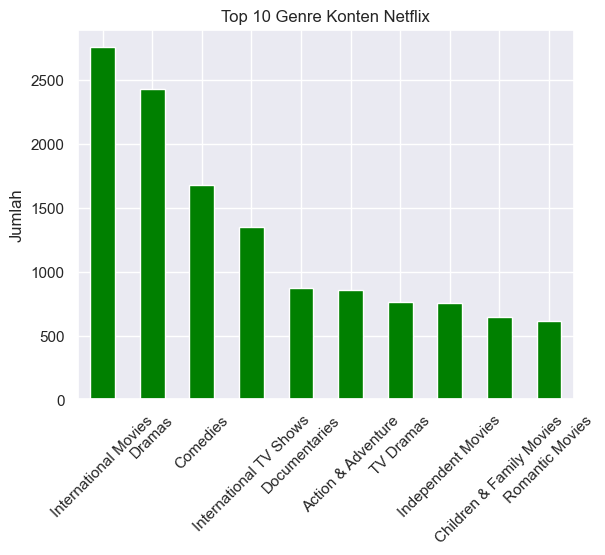
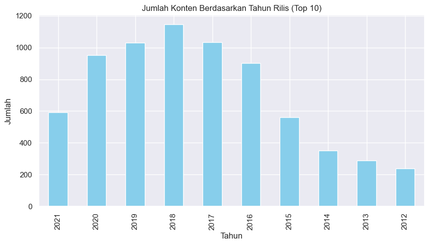

# 🎬 Netflix Data Explorer

**Netflix Data Explorer** is a mini project built with Python that visualizes Netflix movie & TV series data. Its goal is to explore content trends based on genre, release year, and country, and to serve as a portfolio project for a Data Analyst Intern role.

## 📁 Folder Structure

```
netflix-data-explorer/
│
├── data/
│   └── netflix_titles.csv           # Main dataset
│
├── notebooks/
│   └── netflix_data_explorer.ipynb  # Exploratory Data Analysis (EDA)
│
├── visuals/
│   ├── genre_distribution.png       # Genre distribution visualization
│   └── release_trend.png            # Content release trend visualization
│
├── streamlit_app.py                 # Interactive web app (optional)
└── README.md                        # Project documentation
```

## 📊 Tools & Libraries

- `pandas`, `numpy` – for data manipulation
- `matplotlib`, `seaborn` – for data visualization
- `streamlit` (optional) – for building an interactive dashboard

## ✨ Key Features

- View distribution of Netflix content by genre
- Analyze movie/series release trends by year
- Display number of titles by country
- Optional interactive dashboard using Streamlit

## 📂 Dataset

Dataset used: `netflix_titles.csv`  
Source: [Kaggle - Netflix Movies and TV Shows](https://www.kaggle.com/datasets/shivamb/netflix-shows)

## 🚀 How to Run (Optional - Streamlit)

```bash
pip install -r requirements.txt
streamlit run streamlit_app.py
```

## 📸 Example Visualizations

### Genre Distribution


### Content Release Trend


## 💡 Why This Project?

This project was created as a portfolio piece to demonstrate skills relevant to a **Data Analyst Intern** role:

- Cleaning and exploring datasets
- Identifying trends and patterns
- Creating meaningful visualizations
- Using data exploration tools (Jupyter Notebook & Streamlit)

## 📌 Notes

- The `streamlit_app.py` file is optional.
- This project can be extended to include recommendation systems or advanced filtering features.

## 🧑‍💻 Author

Zaidan Mahfudz Azzam  
[LinkedIn](https://linkedin.com/in/zaidanmahfudz) | [GitHub](https://github.com/ZaanmaVerse)
